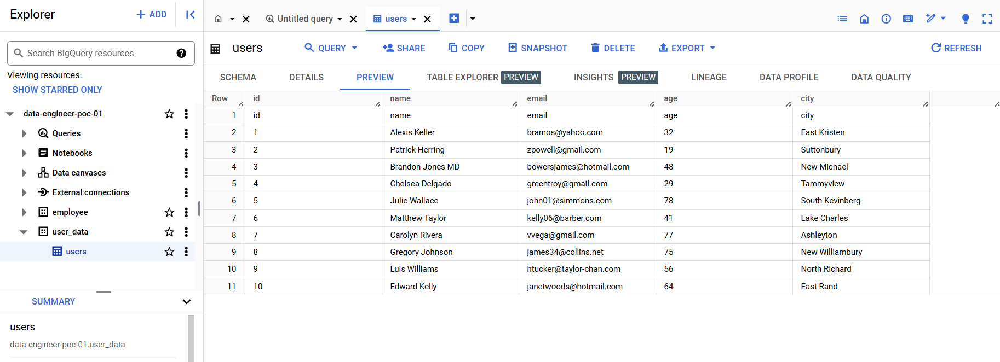

# Create a data pipeline using Cloud Function and Data Flow automate it to load into Bigquery

## Architecture:
1. Cloud Function: This will be the entry point for our data pipeline. It will be triggered
by a Cloud Storage bucket notification when a new file is uploaded.
2. Data Flow: This will be used to process the data and load it into BigQuery.
3. BigQuery: This is where our processed data will be stored.
4. Cloud Storage: This is where our raw data will be stored.

## Objective:

update in GCS bucket >> Cloud Function has to trigger >> Data Flow job should run automatically >> Data loaded into Big Query table.

### Steps:
1. Create a bucket for landing zone.
2. Create the bigquery dataset.
3. Create a Data Flow job , test it whether it loads the data into BigQuery table.
4. Create a Cloud Function that triggers on a file upload to a GCS bucket.

## Tada!

