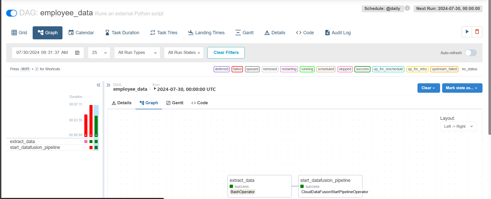
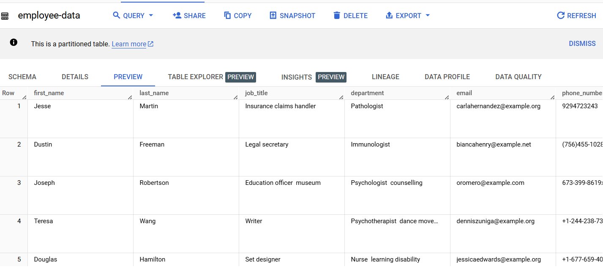

# ETL Project with Data Fusion, Airflow, and BigQuery

This repository contains code and configuration files for an Extract, Transform, Load (ETL) project using Google Cloud Data Fusion for data extraction, Apache Airflow/Composer for orchestration, and Google BigQuery for data loading.

## Overview

The project aims to perform the following tasks:

1. **Data Extraction**: Extract data using python.
2. **Data Masking**: Apply data masking & encoding techniques to sensitive information in Cloud Data Fusion before loading it into BigQuery.
3. **Data Loading**: Load transformed data into Google BigQuery tables.
4. **Orchestration**: Automate complete Data pipeline using Airflow ( Cloud Composer )

## Architecture

## Getting Started
### Prerequisites
- Google Cloud Account
- Google Cloud SDK installed on your machine
- Python 3.8 or higher installed on your machine

### Installation
1. Clone the repository using the following command: `git clone https://github.com/tajugouse/GCP_Data_Engineer_Pipelines/tree/main/Data_Fusion_pipeline
2. Install the required packages using pip: `pip install -r requirements.txt`
3. Create a new Google Cloud project and enable the necessary APIs (Data Fusion, Composer, Bigquery)
4. Create a Cloud Storage bucket for storing data
5. Create a Cloud Data Fusion instance
6. Create a Cloud Composer instance 
7. Create a BigQuery dataset and table
8. create a pipeline using data fusion instance and tranform the data as per requirement and deoply it.

Once Job is committed data get integrated in Bigquery table.

9. create dag.py file define your DAG name, email, script file location and dag storage path.
10. create respective folder in gcloud to store these and upload your dag.py and extract.py file

## Tada!!

