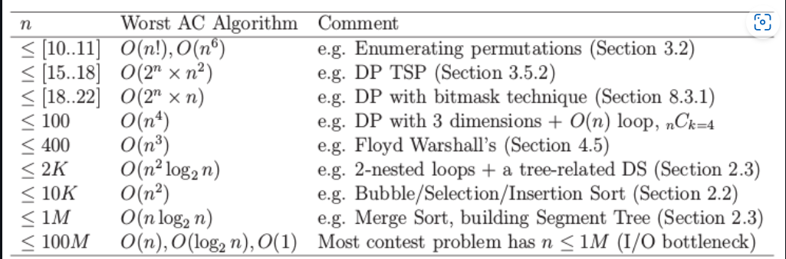
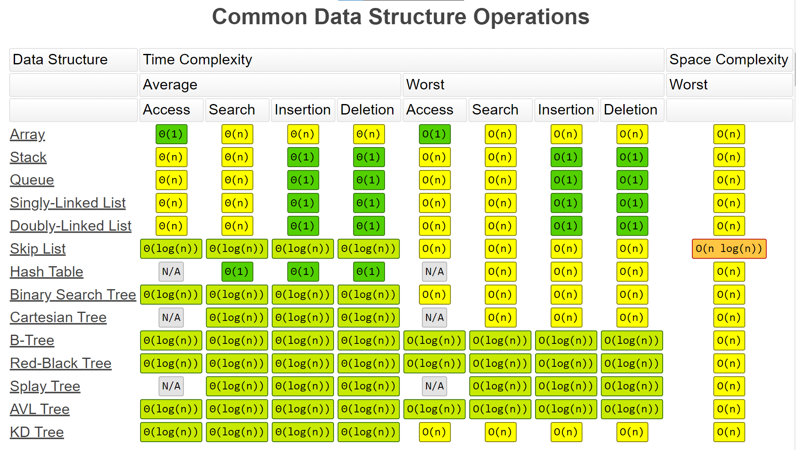
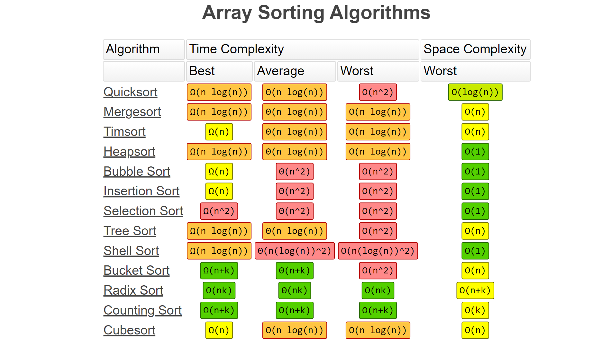

# Data Structures :

A Data Structures is a way of storing/organizing data in the memory in such a way that access, managment and modicfication of data can be effiecient.

# Algorithm:

A algorithm is a step by step procedure to solve logical and mathematical problems. It is any approch you use to perform on data (like sorting, traversing etc.,).

# Time Complexity:

### O(1) < O(log N) < O(sqrt N)  < O(N^2) < O(2^N) < O(N!)

